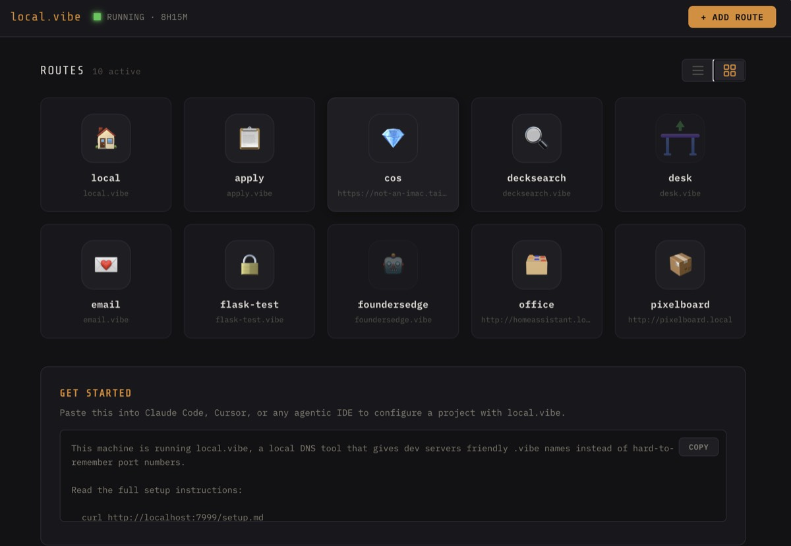
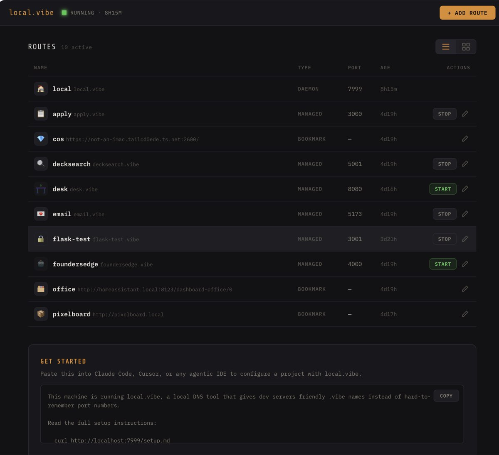

# local.vibe

> `myapp.vibe` instead of `localhost:3000` — for every project on your Mac or Windows box.

<p align="center">
  
</p>

Dev work drifts into a mess of `localhost:3000`, `localhost:5173`, `localhost:8080` tabs. Which port was the blog on again? **local.vibe** gives every local project a friendly `.vibe` hostname and puts start/stop controls in one dashboard at [https://local.vibe](https://local.vibe).

macOS and Windows. Single Go binary. No external services.

## What you get

- **Friendly hostnames** — `myapp.vibe` resolves to your local app over HTTP *and* HTTPS
- **Auto-assigned ports** — drop `port` from `vibe.json`, vibe picks a free one and exposes it as `$PORT`
- **Dashboard** — start/stop managed apps, add bookmarks, pick icons, switch list/grid
- **HTTPS built-in** — a local CA is trusted in your Keychain; per-route SANs hot-reload without restart
- **Agent-friendly** — paste `curl http://localhost:7999/setup.md` into Claude Code / Cursor and it understands the setup
- **Git worktrees** — `vibe start` in a worktree gets its own `branch.myapp.vibe` on its own port, no config
- **Bookmark anything** — route `tailscale.vibe` → your Tailscale machine, `office.vibe` → Home Assistant
- **Zero hidden deps** — single binary, Cobra + Go stdlib, no Node, no Docker

## Install

### macOS

```bash
git clone https://github.com/graiz/local.vibe.git
cd local.vibe
./setup.sh
```

Installs Homebrew (if missing), Go, dnsmasq, `/etc/resolver/vibe`, pf rules for port forwarding, and a local TLS CA trusted in your Keychain — then opens the dashboard.

### Windows (preview)

Run from an **elevated** terminal (right-click → "Run as administrator", or `sudo` on Win11 24H2+):

```powershell
git clone https://github.com/graiz/local.vibe.git
cd local.vibe
.\setup.bat
```

`setup.bat` is a thin wrapper that invokes `setup.ps1` with the right ExecutionPolicy override, so you don't need to touch `Set-ExecutionPolicy` first. If you'd rather run the .ps1 directly, set the policy for the session and call it explicitly:

```powershell
Set-ExecutionPolicy -Scope Process -ExecutionPolicy Bypass -Force
.\setup.ps1
```

The script installs Go via winget if missing, builds the binary, copies it to `%LOCALAPPDATA%\Programs\vibe\vibe.exe`, then runs `vibe setup` which:

- before any state change, checks UDP :53 is bindable; if it's held (Acrylic DNS, Internet Connection Sharing, NextDNS, Pi-hole are common), names the offender and offers a clean abort with no system modifications
- generates the local TLS CA + leaf cert and trusts it via `certutil -addstore Root`
- adds netsh portproxy rules so 80→7999 and 443→7443
- snapshots each adapter's pre-vibe DNS to `~/.vibe/dns-backup.json`, then repoints every connected adapter's primary DNS to 127.0.0.1 (the daemon embeds a tiny resolver that answers *.vibe locally and forwards everything else to whichever upstream answered first — your previous DNS server, falling back to 1.1.1.1 / 8.8.8.8 / 9.9.9.9)
- registers a Scheduled Task `vibe` triggered on logon, running at your normal (medium) integrity level — the daemon's runtime needs are all unprivileged on Windows (binding low ports doesn't require admin, unlike POSIX), so dev servers and dashboard handlers don't inherit Administrator
- when a managed route's port is held by another process, the dashboard shows the offender's PID + image name (via `tasklist`) and offers a one-click "Kill PID and Retry"

`vibe uninstall` reverses every step and restores each adapter's DNS from the snapshot. Three safety layers ensure you never end up with a dead resolver: loopback (127.x.x.x) entries are stripped at snapshot time, again at restore time, and a final pass after restore force-resets to DHCP on any adapter still pointing at vibe's removed listener. Re-running `vibe setup` preserves the original backup rather than overwriting it with the post-setup state, so the very first pre-vibe configuration is what gets restored at uninstall.

If something does go wrong, manual recovery is one command per adapter:
```powershell
netsh interface ipv4 set dnsservers name="Wi-Fi" dhcp
```

**Firefox:** modern Firefox honors `security.enterprise_roots.enabled` and reads the Windows root store, so it picks up the local CA automatically. If you still see a cert warning on `https://*.vibe`, open `about:config`, search for `security.enterprise_roots.enabled`, and set it to `true`. Same setting applies on macOS (it reads Keychain).

### Linux

Linux support is documented but not yet automated. Run `./setup.sh` for now and follow the printed instructions, or wait for the dedicated Linux branch.

## Your first app

Drop this in any project root:

```json
{
  "name": "myapp",
  "cmd": "npm run dev"
}
```

```bash
vibe start
# started: myapp → https://myapp.vibe (port 3000)
```

vibe picks a free port starting at 3000 and passes it to your app via `$PORT`. The daemon keeps it running; `vibe stop myapp` shuts it down. Visit `https://myapp.vibe` in any browser.

## Git worktrees

Run `vibe start` inside a linked git worktree and vibe registers
`<branch-slug>.<app>.vibe` on its own auto-assigned port — worktrees never
clobber the main checkout or each other:

```bash
cd ../myapp-worktrees/feature-auth
vibe start
# started: feature-auth.myapp → https://feature-auth.myapp.vibe (port 3241)
```

Leave the worktree's copied `vibe.json` `name` alone — the app name is read from
the main checkout, and renaming it breaks the parent link (dashboard grouping and
inherited OAuth). Worktree routes auto-stop after 60 idle minutes and restart on
the next visit, and are removed automatically once the worktree is gone.

Visiting a stopped app that has worktrees shows a **picker** listing them —
including worktrees on disk that nobody has run `vibe start` in yet, which
launch with the app's own `cmd` in one click. Worktrees also inherit the parent's
`oauth_callback_port`, so a single provider registration covers every branch. See
[setup.md](internal/daemon/setup.md#git-worktrees) for the details.

## Dashboard

<p align="center">
  
</p>

Switch between grid and list views (preference persists across restarts). Each row shows route type, port, uptime, and start/stop/edit controls. The modal editor supports custom emoji or auto-detected favicons; bookmark routes either redirect or reverse-proxy to any external URL — handy for Tailscale hosts or Home Assistant dashboards. Proxy mode keeps the `.vibe` name in the browser's URL bar, with an optional opt-in for self-signed upstream certs.

When a managed route's process rebinds to a different port or exits, the daemon serves a "Reconnecting…" or "Not running" page instead of a dead proxy. It auto-discovers the new port via `lsof` (macOS) or `netstat -ano` filtered by Job Object membership (Windows) plus log-tail regex, and surfaces recovery hints (orphan PID, port-in-use) as one-click "Kill PID X and Retry" buttons.

---

## Reference

### CLI

```bash
vibe --help                          # Show all commands
vibe start                           # Start from vibe.json in the current dir
vibe start myapp                     # Start an already-registered route
vibe start myapp 3000 -- npm run dev # Register + start inline
vibe stop myapp                      # Stop a managed app
vibe restart myapp                   # Stop + start (picks up vibe.json edits)
vibe register myapp 3000             # Static mapping (no process management)
vibe deregister myapp                # Remove a route
vibe list                            # List all routes
vibe status                          # Show daemon health
vibe doctor                          # Diagnose DNS, listeners, redirect, certs
vibe doctor --fix                    # Repair the privileged-port redirect
vibe open myapp                      # Open in browser
vibe dev                             # Rebuild + restart daemon (for contributors)
```

### `vibe.json`

| Field | Required | Description |
|-------|----------|-------------|
| `name` | yes | Subdomain: `name.vibe` |
| `port` | no | Port your app listens on (omit or `0` for auto-assign) |
| `cmd` | yes | Shell command to start the app |
| `icon` | no | Emoji or image URL for the dashboard |
| `idle_timeout` | no | Auto-stop after N minutes of no traffic (0 = never) |
| `oauth_callback_port` | no | Fixed localhost port for OAuth callbacks |
| `reserve_ports` | no | `{"name": port}` map of auxiliary ports the cmd binds; injected as `$PORT_<UPPER_NAME>` (see [setup.md](internal/daemon/setup.md#apps-that-bind-more-than-one-port)) |

**Tip:** use `python3` (not `python`) on macOS. For Python apps, prefer a venv: `".venv/bin/python app.py"`.

> **The one rule — your `cmd` must bind the port vibe assigns, via `$PORT`.** Omit `port` and vibe auto-assigns a free one and injects it as `$PORT`; your app reads it (`process.env.PORT`, `os.environ["PORT"]`) or you pass `--port $PORT`. If the cmd ignores `$PORT` and lets the framework fall back to its own default, the app binds one port while vibe proxies to another. Self-healing port-discovery hides the mismatch for a while — so it *works* until something else claims the registered port, then the route silently stops responding. Frameworks that don't auto-read `$PORT` (Jekyll, Rails, Flask/Django CLI) need an explicit flag — see below. When unsure, pass `--port $PORT`; it never hurts.

### Framework notes

**Vite** (React, Vue, Svelte) — add `.vibe` to `vite.config.js`:
```js
export default defineConfig({ server: { allowedHosts: ['.vibe'] } })
```

**Next.js** — nothing required. Vibe presents the dev server with its own origin on WebSocket upgrades, so hot reload connects over `https://<name>.vibe` out of the box. (Before that, Next's `allowedDevOrigins` check refused the HMR socket, the dev client retried, and after three failures called `location.reload()` — a full page reload every ~20s that silently wiped client state.) If you want to silence Next's cross-origin dev warning for non-HMR requests, add:
```js
module.exports = { allowedDevOrigins: ['*.vibe'] }
```

**Flask** — disable the reloader (debug error pages still work):
```python
app.run(debug=True, use_reloader=False, host='0.0.0.0',
        port=int(os.environ.get("PORT", 5000)))
```
Or via CLI: `flask run --debug --no-reload --port $PORT`

**Django**:
```bash
python3 manage.py runserver --noreload 0.0.0.0:$PORT
```

**Jekyll** — ignores `$PORT` and defaults to 4000, so pass it explicitly:
```bash
bundle exec jekyll serve --port $PORT
```

**Rails**:
```bash
bin/rails server -p $PORT
```

### Route types

| Type | Created by | Lifecycle |
|------|-----------|-----------|
| **managed** | `vibe start` / dashboard | Daemon manages the process; start/stop controls |
| **worktree** | `vibe start` in a git worktree | `<branch>.<app>.vibe` on its own port; auto-stops after 60 idle min; removed with the worktree |
| **sticky** | `vibe register` | Static mapping; persists across daemon restarts |
| **bookmark** | Dashboard | Redirects (307) or reverse-proxies to an external URL |
| **pid** | API only | Removed automatically when the tracked PID exits |
| **ttl** | `--ttl` on `vibe register` | Expires after N seconds |

### HTTP API

All endpoints live under `https://local.vibe/_api/` (or `http://localhost:7999/_api/`).

```bash
curl /_api/health                                # {"status":"ok","routes":3,"uptime":120}
curl /_api/routes                                # List all routes
curl -X POST /_api/routes \
  -H 'Content-Type: application/json' \
  -d '{"name":"app","cmd":"npm run dev","dir":"/path/to/project"}'
curl -X PUT    /_api/routes/app -d '{"port":3001,"icon":"🚀"}'
curl -X POST   /_api/routes/app/start            # 409 if port occupied
curl -X POST   /_api/routes/app/stop
curl           /_api/routes/app/ready            # {"ready":true,"running":true}
curl -X DELETE /_api/routes/app
curl -X PUT    /_api/preferences -d '{"view":"grid"}'
```

Port conflicts return `409` with the occupied port. Immediate process crashes include the last few lines of `~/.vibe/{name}.log` in the error response. Auto-assigned ports come back as `"port": <number>`.

The API is unauthenticated, so **state-changing calls are rejected when they come from another site** — a page on any website could otherwise POST a managed route, whose `cmd` runs as you. The CLI, `curl`, and scripts are unaffected (they send no `Origin`); the dashboard and a route's own vibe-served pages work normally; bookmark routes are deliberately *not* trusted. Blocked calls return `403`. See [setup.md](internal/daemon/setup.md#api-access-from-the-browser).

### Runtime files

| Path | Purpose |
|------|---------|
| `~/.vibe/routes.json` | Persisted routes (sticky, managed, bookmark) |
| `~/.vibe/config.json` | Daemon config (port, TLD, dashboard view) |
| `~/.vibe/certs/` | Local CA + leaf cert (trusted in Keychain on macOS, Windows Root store via certutil on Windows) |
| `~/.vibe/dns-backup.json` | Windows-only: pre-setup adapter DNS snapshot for clean uninstall |
| `~/.vibe/daemon.log` | Daemon log |
| `~/.vibe/{name}.log` | Per-route process logs (tailed on crash) |
| `~/.vibe/daemon.pid` | Daemon PID |
| `~/.vibe/vibe.sock` | Unix socket for CLI ↔ daemon (macOS; Windows falls back to TCP) |

### Agents & automation

`vibe setup` installs a **global agent skill** at `~/.claude/skills/local-vibe/SKILL.md`. Claude Code auto-discovers it in every session, on every project — so a fresh session already knows this machine runs local.vibe and registers dev servers with `vibe` (getting a friendly `https://<name>.vibe`) instead of guessing or hardcoding a port. Skip it with `vibe setup --no-skill`; `vibe uninstall` removes it.

The skill is deliberately lean — it points agents at the full, always-current guide served by the daemon:

```bash
curl http://localhost:7999/setup.md
```

Paste that same URL into any other agentic IDE (Cursor, Codex, etc.) and the agent will know how to register a `.vibe` name for the project.

**Install the skill without running full setup** (or on a machine where vibe is managed elsewhere) via the plugin marketplace bundled in this repo:

```
/plugin marketplace add graiz/local.vibe
/plugin install local-vibe@vibe
```

### Contributing

See [CONTRIBUTING.md](CONTRIBUTING.md). PRs welcome.

### License

[MIT](LICENSE)
